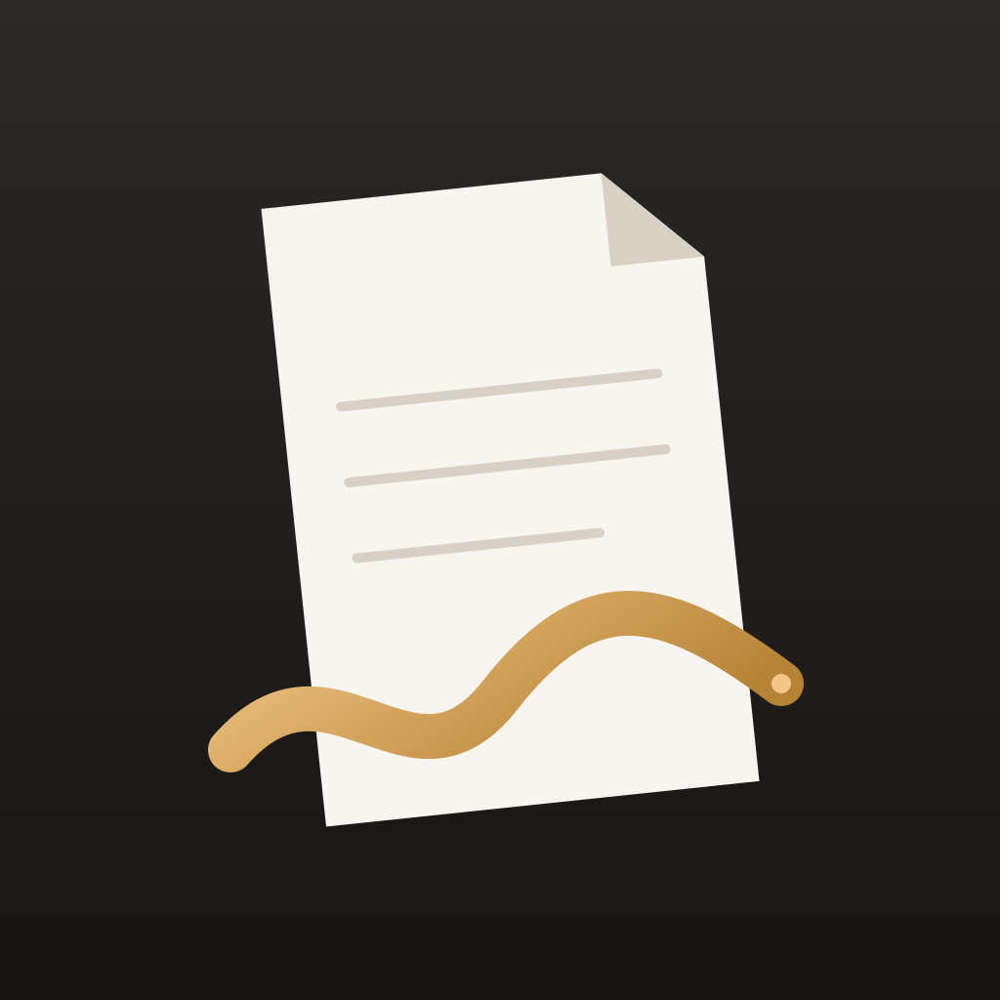

  

<h1 align="center">Noting</h1>

A free, private, handwriting-first note-taking app for iPad — that you build and own yourself.

---

## Why I built this

I wanted a note-taking app for my iPad that was **free**, that I could **customize however I liked**, and that was **completely private** — my notes stay on my iPad, with no accounts, no subscriptions and no cloud in between.

So I built my own, for my personal use. And I'd love for you to use it too.

**This app is AI-generated.** I built it by describing what I wanted to an AI coding assistant, testing it on my iPad, and asking for changes until it worked the way I wanted.

That's also why I'm sharing it. I believe traditional SaaS — paying every month for software that someone else controls — is dying. When anyone can have software made for exactly their needs, it makes more sense to own a small app that does what *you* want than to rent a big one that does what everyone wants. **Noting is my experiment with that idea.** Fork it, make it yours, and change it however you like.

## What it does

- ✍️ **Handwritten notebooks** with Apple Pencil — ruled, grid, dot-grid, Cornell and more paper styles.
- 📄 **Write on PDFs** — import lecture slides, readings or cases and write directly on them, or in a margin beside the page (hide it when you just want to read).
- 🔷 **Snap to shape** — draw a line, box, circle or triangle and hold the pencil still for 2 seconds; it becomes a clean shape.
- 🔍 **Zoom window** — write large in a magnified strip at the bottom; it appears small and neat on the page as you write.
- 🗂️ **Folders** — nest them, rename, move, delete. Deleted notes go to *Recently Deleted* for 30 days.
- 🌙 **Light and dark mode**, bookmarks, page thumbnails, focus mode, and **export to PDF** to share your notes.

## Privacy

- Everything is stored **only on your iPad**, inside the app. There's no account, no server, no analytics, and no network code at all.
- Notes are **encrypted by iPadOS whenever your iPad is locked**.
- The one exception is your own choice: if you use iCloud Backup for your iPad, Apple includes app data in that backup (as it does for every app).

---

## Set it up on your own iPad

You don't need to know how to code. It takes about 20–30 minutes the first time.

### What you need

| | |
|---|---|
| **A Mac** | Required. Apple only lets you install your own apps using Xcode, which runs only on macOS. |
| **Xcode** | Free from the Mac App Store (version 15 or newer). It's a large download — start it first. |
| **An Apple ID** | The one you already use is fine. No paid developer account needed. |
| **An iPad** | Running iPadOS 17 or newer, plus a cable to connect it to your Mac. |
| **Apple Pencil** | Recommended. You can also turn on finger drawing inside the app. |

> **Good to know:** with a free Apple ID, apps you install yourself stop opening after **7 days**. Your notes are safe — just plug your iPad in and press Run in Xcode again (step 6) to refresh it. A paid Apple Developer account ($99/year) extends this to a year.

### Steps

**1. Get your own copy of the code**
- Click **Fork** at the top of this page (you'll need a free GitHub account). This gives you your own copy you can change.
- On your fork, click the green **Code** button → **Download ZIP**, and unzip it on your Mac.
  *(Or, if you use Git: `git clone` your fork.)*

**2. Open it in Xcode**
- Double-click **`NoteTaker.xcodeproj`** in the folder you downloaded.

**3. Sign in with your Apple ID**
- In Xcode's menu bar: **Xcode → Settings → Accounts**, click **+**, choose **Apple ID**, and sign in.

**4. Make the app yours**
- In the left sidebar, click the blue **NoteTaker** project icon at the top, then **Signing & Capabilities**.
- **Team:** choose your name (it will say *Personal Team*).
- **Bundle Identifier:** change `com.example.noting` to something unique, like `com.yourname.noting`.

**5. Prepare your iPad**
- Connect your iPad to your Mac with a cable and tap **Trust** on the iPad if asked.
- On the iPad, turn on **Settings → Privacy & Security → Developer Mode**, and restart when asked.
  *(If you don't see Developer Mode yet, do step 6 once first — it appears after Xcode sees your iPad.)*

**6. Install it**
- At the top of the Xcode window, click the device menu and choose **your iPad**.
- Press the **▶ Run** button (or **⌘R**). The first build takes a few minutes.
- The first time, your iPad will block the app: go to **Settings → General → VPN & Device Management**, tap your Apple ID, and tap **Trust**. Then press Run again.

Noting is now on your Home Screen. 🎉

### Changing things

This is the fun part. Open the folder in an AI coding assistant (for example Claude Code, Cursor or GitHub Copilot), describe what you want — *"add a highlighter-only mode"*, *"make the paper yellow"* — then press Run in Xcode again to see the change on your iPad.

---

## For developers

- SwiftUI + PencilKit + PDFKit, no third-party dependencies. iPadOS 17+.
- Signing values live in `Config/Signing.xcconfig`. Put personal values (team, bundle ID) in `Config/Signing.local.xcconfig` — it's git-ignored, so they never end up in a commit.
- Drawings are stored in a fixed logical page space (`PageGeometry`) and scaled to the screen, so ink stays aligned across devices, rotation and PDF export.
- Main pieces: `FolioLibraryView` (library), `FolioImmersiveEditorView` (editor), `DocumentStore` (storage), `ShapeSnapper` (shape recognition).

## License

[MIT](LICENSE) — free to use, change and share.
